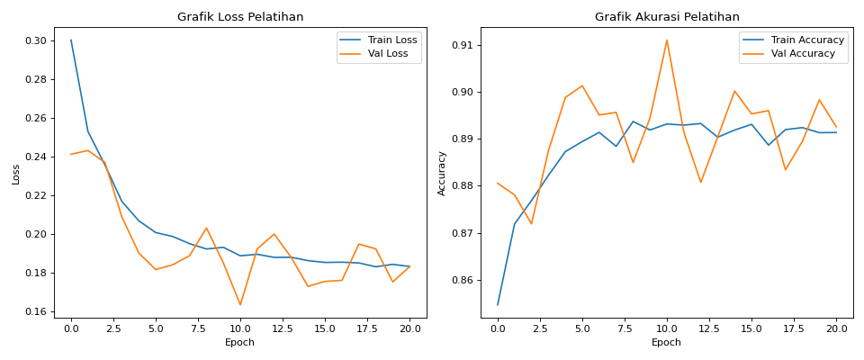
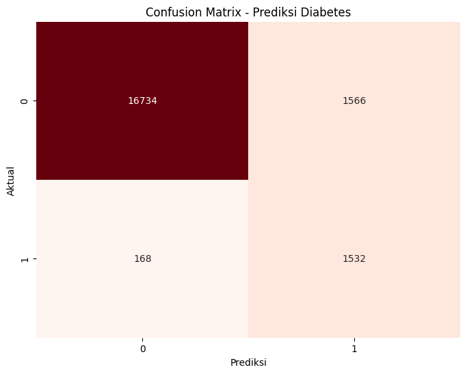
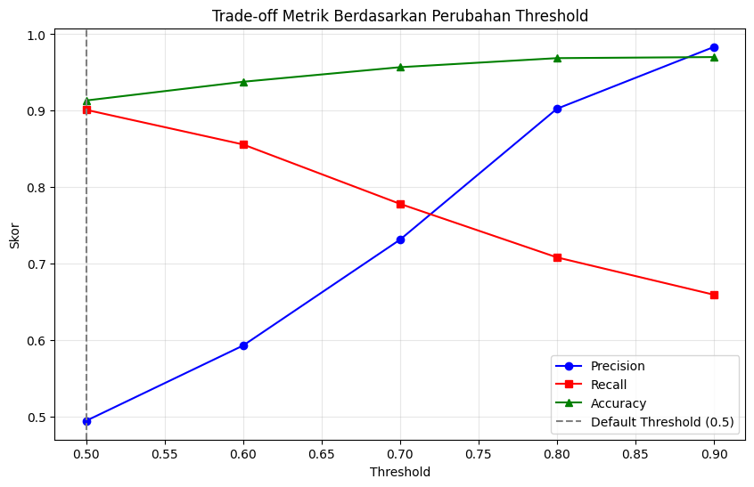

IMPLEMENTASI JARINGAN SARAF TIRUAN BACKPROPAGATION UNTUK PREDIKSI DIABETES BERBASIS WEB FLASK

Nama Penulis
Instansi Penulis (Opsional)

ABSTRAK: Diabetes melitus merupakan tantangan kesehatan global yang memerlukan deteksi dini untuk mencegah komplikasi serius. Penelitian ini bertujuan untuk mengimplementasikan model Jaringan Saraf Tiruan (JST) dengan algoritma Backpropagation guna memprediksi risiko diabetes berdasarkan data demografis dan klinis. Metoda yang digunakan meliputi prapemrosesan data dari Diabetes Prediction Dataset dengan 100.000 baris data, seleksi fitur dengan menghapus variabel ras dan lokasi, serta pelatihan model menggunakan Keras Sequential API. Hasil dan Pembahasan menunjukkan bahwa model mencapai akurasi sebesar 91,33% dan recall sebesar 90,11% pada data uji, yang mengindikasikan efektivitas tinggi dalam mendeteksi kasus positif. Simpulan dan Saran dari penelitian ini adalah algoritma Backpropagation sangat handal sebagai sistem skrining awal medis, dan pengembangan aplikasi berbasis Flask memudahkan aksesibilitas bagi pengguna awam. Disarankan untuk pengembangan selanjutnya dapat mengintegrasikan teknik penanganan ketidakseimbangan data yang lebih lanjut seperti SMOTE.

Kata kunci: Jaringan Saraf Tiruan, Backpropagation, Diabetes, Flask, Prediksi.

ABSTRACT: Diabetes mellitus is a significant global health challenge that requires early detection to prevent serious complications. This study aims to implement an Artificial Neural Network (ANN) model using the Backpropagation algorithm to predict diabetes risk based on demographic and clinical data. The method involves preprocessing the Diabetes Prediction Dataset with 100,000 rows of data, feature selection by removing race and location variables, and model training using the Keras Sequential API. Results and Discussion show that the model achieved an accuracy of 91.33% and a recall of 90.11% on the test data, indicating high effectiveness in detecting positive cases. Conclusion and Suggestion of this research are that the Backpropagation algorithm is highly reliable as an initial medical screening system, and the development of a Flask-based application enhances accessibility for lay users. Future development is suggested to integrate advanced data imbalance handling techniques such as SMOTE.

Keywords: Artificial Neural Network, Backpropagation, Diabetes, Flask, Prediction.

PENDAHULUAN
Diabetes melitus merupakan penyakit metabolik kronis yang ditandai dengan peningkatan kadar glukosa darah. Menurut Organisasi Kesehatan Dunia (WHO, 2023), jumlah penderita diabetes di seluruh dunia terus meningkat, menjadikannya tantangan kesehatan global yang signifikan. Deteksi dini sangat krusial untuk mencegah komplikasi jangka panjang seperti gagal ginjal dan penyakit jantung (Sukra dan Handay, 2015: 96-103). Pemanfaatan Jaringan Saraf Tiruan (JST) dengan algoritma Backpropagation menawarkan solusi untuk klasifikasi risiko medis secara mandiri. Masalah utama dalam deteksi komputasi adalah tingginya angka false negative. Penelitian ini bertujuan membangun model Backpropagation yang dioptimalkan dengan penekanan pada metrik recall untuk memastikan penderita diabetes tidak terlewatkan dalam skrining awal, serta mengimplementasikannya dalam kerangka kerja web Flask (JATI, 2024).

METODA
Penelitian ini menggunakan eksperimen berbasis data sekunder dari Diabetes Prediction Dataset (Kaggle, 2023) dengan total 100.000 data. Prapemrosesan data meliputi penghapusan kolom ras dan lokasi untuk memastikan keadilan (*fairness*) diagnosis. Variabel kategorikal seperti jenis kelamin dan riwayat merokok ditransformasikan menggunakan *one-hot encoding*. Model JST dibangun menggunakan arsitektur 14 neuron input, tiga *hidden layer* (64, 32, dan 16 neuron), dan satu neuron output dengan fungsi aktivasi sigmoid (Chollet, 2021: 45-50). Teknik *class weighting* diterapkan untuk menangani ketidakseimbangan kelas (~8,5% pasien diabetes). Waktu pelatihan dioptimalkan menggunakan *Early Stopping* yang menghentikan proses untuk mempertahankan bobot terbaik dan mencegah *overfitting*.

HASIL DAN PEMBAHASAN
Hasil eksperimen menunjukkan model JST mampu mengidentifikasi pola kompleks dengan tingkat konvergensi yang stabil. Gambar 1 menunjukkan grafik loss dan akurasi selama proses pelatihan.

Gambar 1  Grafik histori pelatihan (Loss dan Akurasi)

Berdasarkan Gambar 1, terlihat bahwa nilai loss pada data training dan validation menurun secara stabil tanpa adanya deviasi signifikan, yang mengindikasikan model tidak mengalami overfitting yang parah. Mekanisme Early Stopping berhasil mempertahankan bobot model pada performa generalisasi terbaik.

Tabel 1 Ringkasan Performa Model (model_ref)
Metrik                  Hasil Proyek            Referensi Colab
Akurasi                 91,33%                  91,30%
Recall                  90,11%                  89,76%
Presisi                 49,45%                  49,37%

Uraian tentang Hasil dan Pembahasan menunjukkan bahwa skor akurasi (91,33%) membuktikan ketepatan prediksi model secara keseluruhan sangat tinggi. Capaian skor recall sebesar 90,11% merupakan aspek terpenting karena model mampu mendeteksi penderita diabetes yang sebenarnya secara optimal.

Gambar 2  Confusion Matrix Prediksi Diabetes

Berdasarkan Confusion Matrix pada Gambar 2, dapat dilihat bahwa jumlah penderita diabetes yang salah terdeteksi sebagai sehat (*False Negative*) sangat rendah dibandingkan dengan penderita yang terdeteksi secara benar (*True Positive*). Hal ini meminimalkan risiko medis yang fatal dalam tahap skrining awal.

Analisis Perubahan Threshold
Pengujian dilakukan dengan mengubah ambang batas (*threshold*) probabilitas untuk melihat pengaruhnya terhadap presisi dan recall.

Gambar 3  Grafik Trade-off Metrik Berdasarkan Threshold

Tabel 2 Analisis Perubahan Threshold
Threshold       Precision       Recall       Accuracy
0,5             0,4945          0,9011       0,9133
0,6             0,5929          0,8558       0,9378
0,7             0,7313          0,7782       0,9568
0,8             0,9025          0,7082       0,9687
0,9             0,9833          0,6594       0,9701

Hasil pada Tabel 2 dan Gambar 3 menunjukkan bahwa menaikkan threshold ke 0,8 meningkatkan presisi secara drastis (90,25%), namun menurunkan recall. Untuk kepentingan skrining medis awal, threshold 0,5 tetap direkomendasikan guna menjaga sensitivitas deteksi maksimal.

Implementasi Antarmuka Web
Aplikasi web dikembangkan menggunakan Flask dengan antarmuka Merah-Putih. Sistem menyediakan fitur prediksi *real-time* dengan visualisasi tingkat risiko dan keyakinan model, memudahkan pengguna awam dalam melakukan skrining mandiri secara cepat.

SIMPULAN DAN SARAN
Simpulan dari penelitian ini menegaskan bahwa algoritma Backpropagation pada skala 100.000 data sangat efektif sebagai sistem skrining awal. Model berhasil mencapai recall tinggi yang krusial untuk meminimalkan pasien sakit yang dianggap sehat. Secara operasional, model ini sangat layak digunakan di fasilitas kesehatan sebagai deteksi dini. Saran untuk pengembangan selanjutnya adalah penggunaan teknik penanganan ketidakseimbangan data yang lebih canggih serta optimasi hiperparameter lebih lanjut untuk menyeimbangkan nilai presisi tanpa mengorbankan recall.

PUSTAKA ACUAN

Buku
Chollet, F. (2021). Deep Learning with Python, Second Edition. New York: Manning Publications.
Miarso, Y. (2004). Menyemai Benih Teknologi Pendidikan. Jakarta: Prenada Media.

Jurnal/Prosiding/Disertasi/Tesis/Skripsi
Arteii. (2024). Implementasi Algoritma Jaringan Syaraf Tiruan Backpropagation untuk Prediksi Penyakit Diabetes. Jurnal Ilmu Komputer dan Teknologi.
JATI. (2024). Prediksi Dini Resiko Penyakit Diabetes Menggunakan Jaringan Syaraf Tiruan Backpropagation. Jurnal Mahasiswa Teknik Informatika (JATI) Vol. 8 No. 1.
Sukra, I. N. dan Handay, L. N. C. (2015). Pengaruh Penggunaan Buku Ajar (Modul) Terhadap Hasil Belajar Bahasa Inggris Untuk Akuntansi. Jurnal Teknodik Vol. 18 No. 3 Edisi Juni 2015. hal 96-103.

Lain-lain
Kaggle. (2023). Diabetes Prediction Dataset. https://www.kaggle.com/datasets/iammustafatz/diabetes-prediction-dataset (Diunduh tanggal 1 Mei 2026).
WHO. (2023). Global report on diabetes: Update on prevalence and prevention. World Health Organization.
